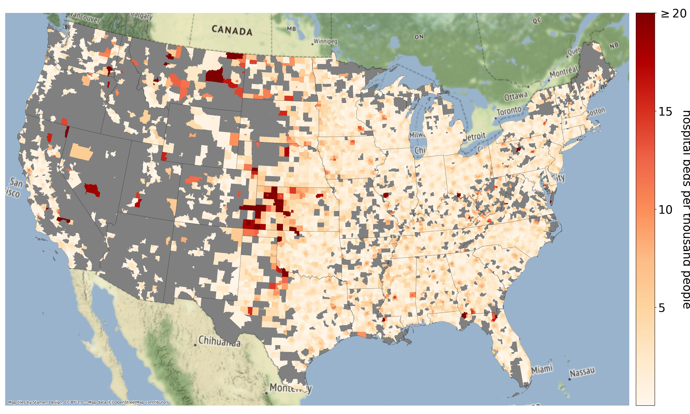

# SPACTS: a Spatial Partitioning Algorithm for Computing Travel-time at Scale

*Image: Overiew of the SPACTS algorithm*

**Repo Author:** Alexander Michels  
**Paper Authors:** Alexander Michels, Jinwoo Park, Jeon-Young Kang, and Shaowen Wang  
**Paper:** In preparation

**Paper Abstract:**

> We present a Spatial Partitioning Algorithm for Computing Travel-time at Scale
(SPACTS). Calculating travel-time catchments over large spatial extents is com-
putationally intensive, with previous work limiting their spatial extent to mini-
mize computational burden or overcoming the computational burden with advanced
cyberinfrastructure. SPACTS is designed for domain decomposition of travel-time
catchment calculations with a user-provided memory limit on computation. SPACTS
realizes this through spatial partitioning that preserves spatial relationships required
to compute travel-time zones and respects a user-provided memory limit. This al-
lows users to efficiently calculate travel-time catchments within a given memory limit
and represents a significant speed-up over computing each catchment separately. We
demonstrate SPACTS by computing spatial accessibility to hospital beds across the
conterminous United States. Our case study shows that SPACTS achieves signifi-
cant efficiency and scalability making the computation of travel-time catchment up
to 51 times faster.

SPACTS is designed as a novel algorithm for paritioning points in space *together* with the spatial context of the points. It was specifically designed for enabling scalable and memory constrained travel-time catchment calculations for spatial accessibility analysis. This repository contains:

* `data` - the necessary data for SPACTS and accessibility calculation. Due to file limits, we do not provide the OSM network data necessary for calculating travel-time. However, we do give pre-compute travel-time catchments for our hospital data set and...
* `scripts` - we provide the necessary scripts for pulling OSM networks with OSMnx for the entire Contiguous United States and calculating the memory usage of each county's road network!
* `notebooks` - notebooks for SPACTS and accessibiilty at various spatial extents.

For more information about the data and scripts, see the READMEs in the respective directories.

## Notebooks

* Using SPACTS:
  * Illinois: [notebooks/SPACTS-Illinois.ipynb](notebooks/SPACTS-Illinois.ipynb)
  * Midwest US: [notebooks/SPACTS-Midwest.ipynb](notebooks/SPACTS-Midwest.ipynb)
  * Contiguous US: [notebooks/SPACTS-Contiguous.ipynb](notebooks/SPACTS-Contiguous.ipynb)
  * Merging results from parallel jobs run with SPACTS to a single shapefile: [notebooks/MergingCatchments.ipynb](notebooks/MergingCatchments.ipynb)
* Calculating Enhanced Two-Step Floating Catchment Area (E2SFCA):
  * Illinois, Midwest, and Contiguous US: [notebooks/CalculateAccessibility.ipynb](notebooks/CalculateAccessibility.ipynb)
* Analyzing the runtime of the SPACTS algorithm: [notebooks/MergingCatchments.ipynb](notebooks/MergingCatchments.ipynb)

*Image: Travel-time catchments for our hospital dataset*

*Image: Accessibility to hospital beds using E2SFCA for the conterminous U.S.*